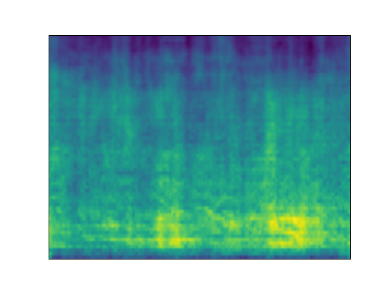
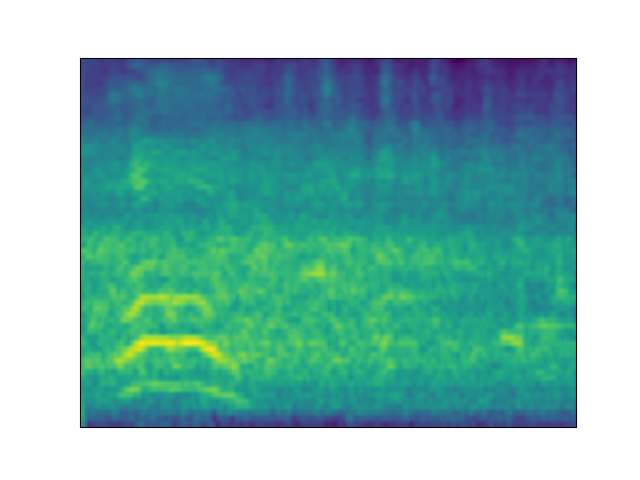
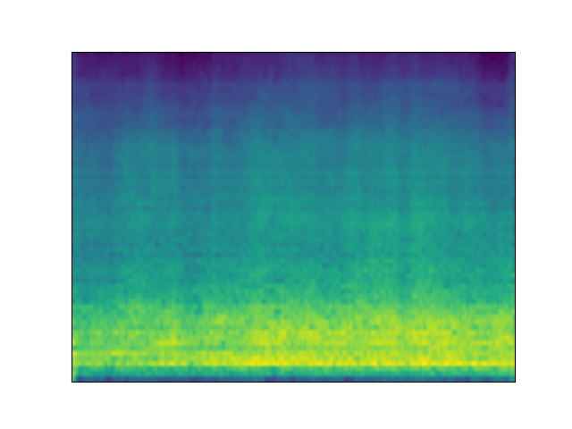
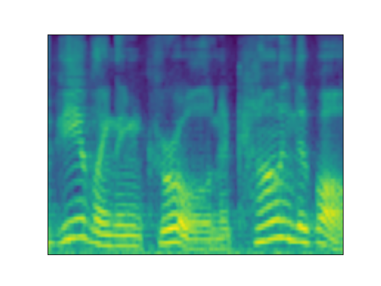
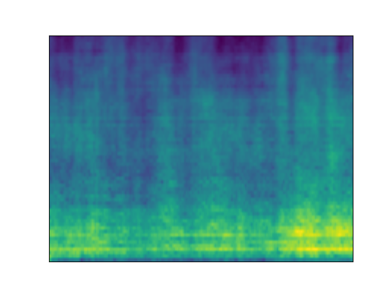
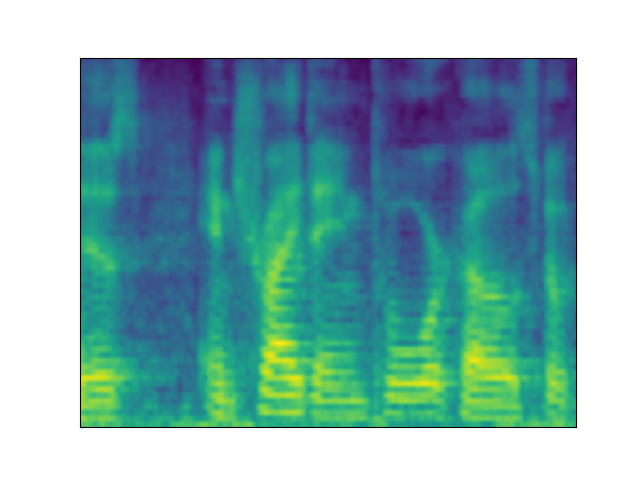

## Brain2Sound Dataset

<table class="gallery-table">
  <thead>
    <tr>
      <th>Stimulus</th>
      <th>LiR</th>
      <th>Fine-LDM</th>
      <th>C2F-LDM (ours)</th>
    </tr>
  </thead>
  <tbody>
    <tr>
      <td>
        

          
          <audio controls>
            <source src="assets/recon/Brain2Sound/ground%20truth/sample1.wav" type="audio/mp3">
            Your browser does not support the audio element.
          </audio>
        

      </td>
      <td>
        

          
          <audio controls>
            <source src="assets/recon/Brain2Sound/S1/LiR/sample1.wav" type="audio/mp3">
            Your browser does not support the audio element.
          </audio>
        

      </td>
      <td>
        

          
          <audio controls>
            <source src="assets/recon/Brain2Sound/S1/Fine-LDM/sample1.wav" type="audio/mp3">
            Your browser does not support the audio element.
          </audio>
        

      </td>
      <td>
        

          
          <audio controls>
            <source src="assets/recon/Brain2Sound/S1/C2F-LDM%20(ours)/sample1.wav" type="audio/mp3">
            Your browser does not support the audio element.
          </audio>
        

      </td>
    </tr>
    <tr>
      <td>
        

          
          <audio controls>
            <source src="assets/recon/Brain2Sound/ground%20truth/sample2.wav" type="audio/mp3">
            Your browser does not support the audio element.
          </audio>
        

      </td>
      <td>
        

          
          <audio controls>
            <source src="assets/recon/Brain2Sound/S1/LiR/sample2.wav" type="audio/mp3">
            Your browser does not support the audio element.
          </audio>
        

      </td>
      <td>
        

          
          <audio controls>
            <source src="assets/recon/Brain2Sound/S1/Fine-LDM/sample2.wav" type="audio/mp3">
            Your browser does not support the audio element.
          </audio>
        

      </td>
      <td>
        

          
          <audio controls>
            <source src="assets/recon/Brain2Sound/S1/C2F-LDM%20(ours)/sample2.wav" type="audio/mp3">
            Your browser does not support the audio element.
          </audio>
        

      </td>
    </tr>
    <tr>
      <td>
        

          
          <audio controls>
            <source src="assets/recon/Brain2Sound/ground%20truth/sample3.wav" type="audio/mp3">
            Your browser does not support the audio element.
          </audio>
        

      </td>
      <td>
        

          
          <audio controls>
            <source src="assets/recon/Brain2Sound/S1/LiR/sample3.wav" type="audio/mp3">
            Your browser does not support the audio element.
          </audio>
        

      </td>
      <td>
        

          
          <audio controls>
            <source src="assets/recon/Brain2Sound/S1/Fine-LDM/sample3.wav" type="audio/mp3">
            Your browser does not support the audio element.
          </audio>
        

      </td>
      <td>
        

          
          <audio controls>
            <source src="assets/recon/Brain2Sound/S1/C2F-LDM%20(ours)/sample3.wav" type="audio/mp3">
            Your browser does not support the audio element.
          </audio>
        

      </td>
    </tr>
    <tr>
      <td>
        

          
          <audio controls>
            <source src="assets/recon/Brain2Sound/ground%20truth/sample5.wav" type="audio/mp3">
            Your browser does not support the audio element.
          </audio>
        

      </td>
      <td>
        

          
          <audio controls>
            <source src="assets/recon/Brain2Sound/S1/LiR/sample5.wav" type="audio/mp3">
            Your browser does not support the audio element.
          </audio>
        

      </td>
      <td>
        

          
          <audio controls>
            <source src="assets/recon/Brain2Sound/S1/Fine-LDM/sample5.wav" type="audio/mp3">
            Your browser does not support the audio element.
          </audio>
        

      </td>
      <td>
        

          
          <audio controls>
            <source src="assets/recon/Brain2Sound/S1/C2F-LDM%20(ours)/sample5.wav" type="audio/mp3">
            Your browser does not support the audio element.
          </audio>
        

      </td>
    </tr>
    <tr>
      <td>
        

          
          <audio controls>
            <source src="assets/recon/Brain2Sound/ground%20truth/sample6.wav" type="audio/mp3">
            Your browser does not support the audio element.
          </audio>
        

      </td>
      <td>
        

          
          <audio controls>
            <source src="assets/recon/Brain2Sound/S1/LiR/sample6.wav" type="audio/mp3">
            Your browser does not support the audio element.
          </audio>
        

      </td>
      <td>
        

          
          <audio controls>
            <source src="assets/recon/Brain2Sound/S1/Fine-LDM/sample6.wav" type="audio/mp3">
            Your browser does not support the audio element.
          </audio>
        

      </td>
      <td>
        

          
          <audio controls>
            <source src="assets/recon/Brain2Sound/S1/C2F-LDM%20(ours)/sample6.wav" type="audio/mp3">
            Your browser does not support the audio element.
          </audio>
        

      </td>
    </tr>
  </tbody>
</table>

 

## Brain2Music Dataset

<table class="gallery-table">
  <thead>
    <tr>
      <th>Stimulus</th>
      <th>LiR</th>
      <th>Fine-LDM</th>
      <th>C2F-LDM (ours)</th>
    </tr>
  </thead>
  <tbody>
    <tr>
      <td>
        

          
          <audio controls>
            <source src="assets/recon/Brain2Music/ground%20truth/sample1.wav" type="audio/mp3">
            Your browser does not support the audio element.
          </audio>
        

      </td>
      <td>
        

          
          <audio controls>
            <source src="assets/recon/Brain2Music/sub-001/LiR/sample1.wav" type="audio/mp3">
            Your browser does not support the audio element.
          </audio>
        

      </td>
      <td>
        

          
          <audio controls>
            <source src="assets/recon/Brain2Music/sub-001/Fine-LDM/sample1.wav" type="audio/mp3">
            Your browser does not support the audio element.
          </audio>
        

      </td>
      <td>
        

          
          <audio controls>
            <source src="assets/recon/Brain2Music/sub-001/C2F-LDM%20(ours)/sample1.wav" type="audio/mp3">
            Your browser does not support the audio element.
          </audio>
        

      </td>
    </tr>
    <tr>
      <td>
        

          
          <audio controls>
            <source src="assets/recon/Brain2Music/ground%20truth/sample2.wav" type="audio/mp3">
            Your browser does not support the audio element.
          </audio>
        

      </td>
      <td>
        

          
          <audio controls>
            <source src="assets/recon/Brain2Music/sub-001/LiR/sample2.wav" type="audio/mp3">
            Your browser does not support the audio element.
          </audio>
        

      </td>
      <td>
        

          
          <audio controls>
            <source src="assets/recon/Brain2Music/sub-001/Fine-LDM/sample2.wav" type="audio/mp3">
            Your browser does not support the audio element.
          </audio>
        

      </td>
      <td>
        

          
          <audio controls>
            <source src="assets/recon/Brain2Music/sub-001/C2F-LDM%20(ours)/sample2.wav" type="audio/mp3">
            Your browser does not support the audio element.
          </audio>
        

      </td>
    </tr>
    <tr>
      <td>
        

          
          <audio controls>
            <source src="assets/recon/Brain2Music/ground%20truth/sample3.wav" type="audio/mp3">
            Your browser does not support the audio element.
          </audio>
        

      </td>
      <td>
        

          
          <audio controls>
            <source src="assets/recon/Brain2Music/sub-001/LiR/sample3.wav" type="audio/mp3">
            Your browser does not support the audio element.
          </audio>
        

      </td>
      <td>
        

          
          <audio controls>
            <source src="assets/recon/Brain2Music/sub-001/Fine-LDM/sample3.wav" type="audio/mp3">
            Your browser does not support the audio element.
          </audio>
        

      </td>
      <td>
        

          
          <audio controls>
            <source src="assets/recon/Brain2Music/sub-001/C2F-LDM%20(ours)/sample3.wav" type="audio/mp3">
            Your browser does not support the audio element.
          </audio>
        

      </td>
    </tr>
  </tbody>
</table>

 

## Brain2Speech Dataset

<table class="gallery-table">
  <thead>
    <tr>
      <th>Stimulus</th>
      <th>LiR</th>
      <th>Fine-LDM</th>
      <th>C2F-LDM (ours)</th>
    </tr>
  </thead>
  <tbody>
    <tr>
      <td>
        

          
          <audio controls>
            <source src="assets/recon/Brain2Speech/ground%20truth/sample1.wav" type="audio/mp3">
            Your browser does not support the audio element.
          </audio>
        

      </td>
      <td>
        

          
          <audio controls>
            <source src="assets/recon/Brain2Speech/UTS01/LiR/sample1.wav" type="audio/mp3">
            Your browser does not support the audio element.
          </audio>
        

      </td>
      <td>
        

          
          <audio controls>
            <source src="assets/recon/Brain2Speech/UTS01/Fine-LDM/sample1.wav" type="audio/mp3">
            Your browser does not support the audio element.
          </audio>
        

      </td>
      <td>
        

          
          <audio controls>
            <source src="assets/recon/Brain2Speech/UTS01/C2F-LDM%20(ours)/sample1.wav" type="audio/mp3">
            Your browser does not support the audio element.
          </audio>
        

      </td>
    </tr>
    <tr>
      <td>
        

          
          <audio controls>
            <source src="assets/recon/Brain2Speech/ground%20truth/sample2.wav" type="audio/mp3">
            Your browser does not support the audio element.
          </audio>
        

      </td>
      <td>
        

          
          <audio controls>
            <source src="assets/recon/Brain2Speech/UTS01/LiR/sample2.wav" type="audio/mp3">
            Your browser does not support the audio element.
          </audio>
        

      </td>
      <td>
        

          
          <audio controls>
            <source src="assets/recon/Brain2Speech/UTS01/Fine-LDM/sample2.wav" type="audio/mp3">
            Your browser does not support the audio element.
          </audio>
        

      </td>
      <td>
        

          
          <audio controls>
            <source src="assets/recon/Brain2Speech/UTS01/C2F-LDM%20(ours)/sample2.wav" type="audio/mp3">
            Your browser does not support the audio element.
          </audio>
        

      </td>
    </tr>
    <tr>
      <td>
        

          
          <audio controls>
            <source src="assets/recon/Brain2Speech/ground%20truth/sample3.wav" type="audio/mp3">
            Your browser does not support the audio element.
          </audio>
        

      </td>
      <td>
        

          
          <audio controls>
            <source src="assets/recon/Brain2Speech/UTS01/LiR/sample3.wav" type="audio/mp3">
            Your browser does not support the audio element.
          </audio>
        

      </td>
      <td>
        

          
          <audio controls>
            <source src="assets/recon/Brain2Speech/UTS01/Fine-LDM/sample3.wav" type="audio/mp3">
            Your browser does not support the audio element.
          </audio>
        

      </td>
      <td>
        

          
          <audio controls>
            <source src="assets/recon/Brain2Speech/UTS01/C2F-LDM%20(ours)/sample3.wav" type="audio/mp3">
            Your browser does not support the audio element.
          </audio>
        

      </td>
    </tr>
  </tbody>
</table>