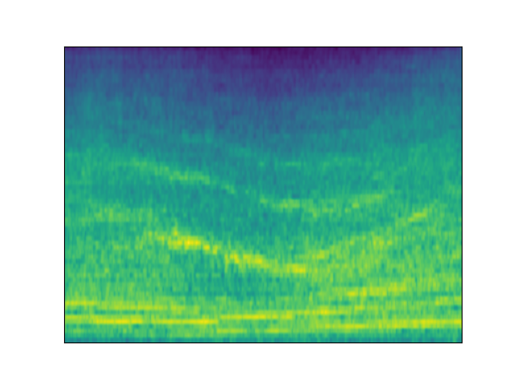
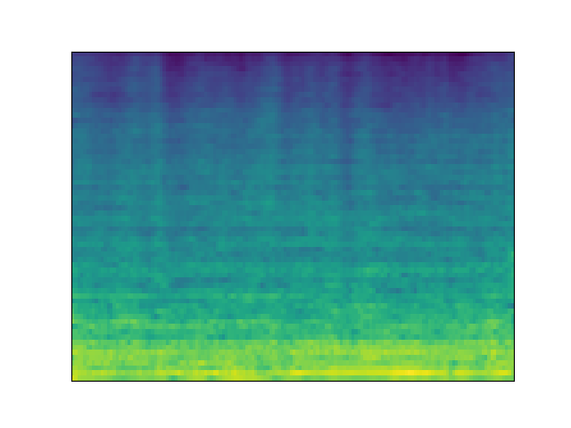

## Brain2Sound Dataset

<table class="gallery-table">
  <thead>
    <tr>
      <th class="left-header"></th>
      <th>Stimulus</th>
      <th>LiR</th>
      <th>Fine-LDM</th>
      <th>C2F-LDM (ours)</th>
    </tr>
  </thead>
  <tbody>
    <tr>
      <td class="left-header">Reconstruction</td>
      <td>
        

          
          <audio controls>
            <source src="assets/recon/Brain2Sound/ground%20truth/sample1.wav" type="audio/mp3">
            Your browser does not support the audio element.
          </audio>
        

      </td>
      <td>
        

          
          <audio controls>
            <source src="assets/recon/Brain2Sound/S1/LiR/sample1.wav" type="audio/mp3">
            Your browser does not support the audio element.
          </audio>
        

      </td>
      <td>
        

          
          <audio controls>
            <source src="assets/recon/Brain2Sound/S1/Fine-LDM/sample1.wav" type="audio/mp3">
            Your browser does not support the audio element.
          </audio>
        

      </td>
      <td>
        

          
          <audio controls>
            <source src="assets/recon/Brain2Sound/S1/C2F-LDM%20(ours)/sample1.wav" type="audio/mp3">
            Your browser does not support the audio element.
          </audio>
        

      </td>
    </tr>
    <tr>
      <th class="left-header">Comparison</th>
      <th colspan="4" class="explanation"> &nbsp;&nbsp; Stimulus is the sound of a cow. C2F-LDM is not identical, but its frequency is similar. </th>
    </tr>
    <tr>
      <td class="left-header">Reconstruction</td>
      <td>
        

          
          <audio controls>
            <source src="assets/recon/Brain2Sound/ground%20truth/sample2.wav" type="audio/mp3">
            Your browser does not support the audio element.
          </audio>
        

      </td>
      <td>
        

          
          <audio controls>
            <source src="assets/recon/Brain2Sound/S1/LiR/sample2.wav" type="audio/mp3">
            Your browser does not support the audio element.
          </audio>
        

      </td>
      <td>
        

          
          <audio controls>
            <source src="assets/recon/Brain2Sound/S1/Fine-LDM/sample2.wav" type="audio/mp3">
            Your browser does not support the audio element.
          </audio>
        

      </td>
      <td>
        

          
          <audio controls>
            <source src="assets/recon/Brain2Sound/S1/C2F-LDM%20(ours)/sample2.wav" type="audio/mp3">
            Your browser does not support the audio element.
          </audio>
        

      </td>
    </tr>
    <tr>
      <th class="left-header">Comparison</th>
      <th colspan="4" class="explanation"> &nbsp;&nbsp; C2F-LDM reconstructs the piano sound in Stimulus, while Fine-LDM is the guitar sound. </th>
    </tr>
    <tr>
      <td class="left-header">Reconstruction</td>
      <td>
        

          
          <audio controls>
            <source src="assets/recon/Brain2Sound/ground%20truth/sample3.wav" type="audio/mp3">
            Your browser does not support the audio element.
          </audio>
        

      </td>
      <td>
        

          
          <audio controls>
            <source src="assets/recon/Brain2Sound/S1/LiR/sample3.wav" type="audio/mp3">
            Your browser does not support the audio element.
          </audio>
        

      </td>
      <td>
        

          
          <audio controls>
            <source src="assets/recon/Brain2Sound/S1/Fine-LDM/sample3.wav" type="audio/mp3">
            Your browser does not support the audio element.
          </audio>
        

      </td>
      <td>
        

          
          <audio controls>
            <source src="assets/recon/Brain2Sound/S1/C2F-LDM%20(ours)/sample3.wav" type="audio/mp3">
            Your browser does not support the audio element.
          </audio>
        

      </td>
    </tr>
    <tr>
      <th class="left-header">Comparison</th>
      <th colspan="4" class="explanation"> &nbsp;&nbsp; C2F-LDM reconstructs the speech in Stimulus, while Fine-LDM reconstructs the singing voice. </th>
    </tr>
    <tr>
      <td class="left-header">Reconstruction</td>
      <td>
        

          
          <audio controls>
            <source src="assets/recon/Brain2Sound/ground%20truth/sample5.wav" type="audio/mp3">
            Your browser does not support the audio element.
          </audio>
        

      </td>
      <td>
        

          
          <audio controls>
            <source src="assets/recon/Brain2Sound/S1/LiR/sample5.wav" type="audio/mp3">
            Your browser does not support the audio element.
          </audio>
        

      </td>
      <td>
        

          
          <audio controls>
            <source src="assets/recon/Brain2Sound/S1/Fine-LDM/sample5.wav" type="audio/mp3">
            Your browser does not support the audio element.
          </audio>
        

      </td>
      <td>
        

          
          <audio controls>
            <source src="assets/recon/Brain2Sound/S1/C2F-LDM%20(ours)/sample5.wav" type="audio/mp3">
            Your browser does not support the audio element.
          </audio>
        

      </td>
    </tr>
    <tr>
      <th class="left-header">Comparison</th>
      <th colspan="4" class="explanation"> &nbsp;&nbsp; C2F-LDM reconstructs the periodicity of Stimulus (although not bird calls), which is better than Fine-LDM. </th>
    </tr>
    <tr>
      <td class="left-header">Reconstruction</td>
      <td>
        

          
          <audio controls>
            <source src="assets/recon/Brain2Sound/ground%20truth/sample6.wav" type="audio/mp3">
            Your browser does not support the audio element.
          </audio>
        

      </td>
      <td>
        

          
          <audio controls>
            <source src="assets/recon/Brain2Sound/S1/LiR/sample6.wav" type="audio/mp3">
            Your browser does not support the audio element.
          </audio>
        

      </td>
      <td>
        

          
          <audio controls>
            <source src="assets/recon/Brain2Sound/S1/Fine-LDM/sample6.wav" type="audio/mp3">
            Your browser does not support the audio element.
          </audio>
        

      </td>
      <td>
        

          
          <audio controls>
            <source src="assets/recon/Brain2Sound/S1/C2F-LDM%20(ours)/sample6.wav" type="audio/mp3">
            Your browser does not support the audio element.
          </audio>
        

      </td>
    </tr>
    <tr>
      <th class="left-header">Comparison</th>
      <th colspan="4" class="explanation"> &nbsp;&nbsp; C2F-LDM reconstructs the periodicity of Stimulus (although not bird calls), which is better than Fine-LDM. </th>
    </tr>
  </tbody>
</table>

 

## Brain2Music Dataset

<table class="gallery-table">
  <thead>
    <tr>
      <th class="left-header"></th>
      <th>Stimulus</th>
      <th>LiR</th>
      <th>Fine-LDM</th>
      <th>C2F-LDM (ours)</th>
    </tr>
  </thead>
  <tbody>
    <tr>
      <td class="left-header">Reconstruction</td>
      <td>
        

          
          <audio controls>
            <source src="assets/recon/Brain2Music/ground%20truth/sample1.wav" type="audio/mp3">
            Your browser does not support the audio element.
          </audio>
        

      </td>
      <td>
        

          
          <audio controls>
            <source src="assets/recon/Brain2Music/sub-001/LiR/sample1.wav" type="audio/mp3">
            Your browser does not support the audio element.
          </audio>
        

      </td>
      <td>
        

          
          <audio controls>
            <source src="assets/recon/Brain2Music/sub-001/Fine-LDM/sample1.wav" type="audio/mp3">
            Your browser does not support the audio element.
          </audio>
        

      </td>
      <td>
        

          
          <audio controls>
            <source src="assets/recon/Brain2Music/sub-001/C2F-LDM%20(ours)/sample1.wav" type="audio/mp3">
            Your browser does not support the audio element.
          </audio>
        

      </td>
    </tr>
    <tr>
      <th class="left-header">Comparison</th>
      <th colspan="4" class="explanation"> &nbsp;&nbsp; The music genre of C2F-LDM is closer to Stimulus. </th>
    </tr>
    <tr>
      <td class="left-header">Reconstruction</td>
      <td>
        

          
          <audio controls>
            <source src="assets/recon/Brain2Music/ground%20truth/sample2.wav" type="audio/mp3">
            Your browser does not support the audio element.
          </audio>
        

      </td>
      <td>
        

          
          <audio controls>
            <source src="assets/recon/Brain2Music/sub-001/LiR/sample2.wav" type="audio/mp3">
            Your browser does not support the audio element.
          </audio>
        

      </td>
      <td>
        

          
          <audio controls>
            <source src="assets/recon/Brain2Music/sub-001/Fine-LDM/sample2.wav" type="audio/mp3">
            Your browser does not support the audio element.
          </audio>
        

      </td>
      <td>
        

          
          <audio controls>
            <source src="assets/recon/Brain2Music/sub-001/C2F-LDM%20(ours)/sample2.wav" type="audio/mp3">
            Your browser does not support the audio element.
          </audio>
        

      </td>
    </tr>
    <tr>
      <th class="left-header">Comparison</th>
      <th colspan="4" class="explanation"> &nbsp;&nbsp; The pitch of C2F-LDM has an obvious process of rising first and then falling, which is consistent with Stimulus. </th>
    </tr>
    <tr>
      <td class="left-header">Reconstruction</td>
      <td>
        

          
          <audio controls>
            <source src="assets/recon/Brain2Music/ground%20truth/sample3.wav" type="audio/mp3">
            Your browser does not support the audio element.
          </audio>
        

      </td>
      <td>
        

          
          <audio controls>
            <source src="assets/recon/Brain2Music/sub-001/LiR/sample3.wav" type="audio/mp3">
            Your browser does not support the audio element.
          </audio>
        

      </td>
      <td>
        

          
          <audio controls>
            <source src="assets/recon/Brain2Music/sub-001/Fine-LDM/sample3.wav" type="audio/mp3">
            Your browser does not support the audio element.
          </audio>
        

      </td>
      <td>
        

          
          <audio controls>
            <source src="assets/recon/Brain2Music/sub-001/C2F-LDM%20(ours)/sample3.wav" type="audio/mp3">
            Your browser does not support the audio element.
          </audio>
        

      </td>
    </tr>
    <tr>
      <th class="left-header">Comparison</th>
      <th colspan="4" class="explanation"> &nbsp;&nbsp; The rhythm of C2F-LDM is closer to Stimulus. </th>
    </tr>
  </tbody>
</table>

 

## Brain2Speech Dataset

<table class="gallery-table">
  <thead>
    <tr>
      <th class="left-header"></th>
      <th>Stimulus</th>
      <th>LiR</th>
      <th>Fine-LDM</th>
      <th>C2F-LDM (ours)</th>
    </tr>
  </thead>
  <tbody>
    <tr>
      <td class="left-header">Reconstruction</td>
      <td>
        

          
          <audio controls>
            <source src="assets/new%20recon/Brain2Speech/ground%20truth/hangtime_069.wav" type="audio/mp3">
            Your browser does not support the audio element.
          </audio>
        

      </td>
      <td>
        

          
          <audio controls>
            <source src="assets/new%20recon/Brain2Speech/LiR/hangtime_069.wav" type="audio/mp3">
            Your browser does not support the audio element.
          </audio>
        

      </td>
      <td>
        

          
          <audio controls>
            <source src="assets/new%20recon/Brain2Speech/Fine-LDM/hangtime_069.wav" type="audio/mp3">
            Your browser does not support the audio element.
          </audio>
        

      </td>
      <td>
        

          
          <audio controls>
            <source src="assets/new%20recon/Brain2Speech/ours/hangtime_069.wav" type="audio/mp3">
            Your browser does not support the audio element.
          </audio>
        

      </td>
    </tr>
    <tr>
      <th class="left-header">Comparison</th>
      <th colspan="4" class="explanation"> &nbsp;&nbsp; C2F-LDM correctly reconstructs the male voice, while Fine-LDM reconstructs the female voice. </th>
    </tr>
    <tr>
      <td class="left-header">Reconstruction</td>
      <td>
        

          
          <audio controls>
            <source src="assets/new%20recon/Brain2Speech/ground%20truth/wheretheressmoke_277.wav" type="audio/mp3">
            Your browser does not support the audio element.
          </audio>
        

      </td>
      <td>
        

          
          <audio controls>
            <source src="assets/new%20recon/Brain2Speech/LiR/wheretheressmoke_277.wav" type="audio/mp3">
            Your browser does not support the audio element.
          </audio>
        

      </td>
      <td>
        

          
          <audio controls>
            <source src="assets/new%20recon/Brain2Speech/Fine-LDM/wheretheressmoke_277.wav" type="audio/mp3">
            Your browser does not support the audio element.
          </audio>
        

      </td>
      <td>
        

          
          <audio controls>
            <source src="assets/new%20recon/Brain2Speech/ours/wheretheressmoke_277.wav" type="audio/mp3">
            Your browser does not support the audio element.
          </audio>
        

      </td>
    </tr>
    <tr>
      <th class="left-header">Comparison</th>
      <th colspan="4" class="explanation"> &nbsp;&nbsp; C2F-LDM has a faster speaking speed and is closer to Stimulus. </th>
    </tr>
    <tr>
      <td class="left-header">Reconstruction</td>
      <td>
        

          
          <audio controls>
            <source src="assets/new%20recon/Brain2Speech/ground%20truth/wheretheressmoke_131.wav" type="audio/mp3">
            Your browser does not support the audio element.
          </audio>
        

      </td>
      <td>
        

          
          <audio controls>
            <source src="assets/new%20recon/Brain2Speech/LiR/wheretheressmoke_131.wav" type="audio/mp3">
            Your browser does not support the audio element.
          </audio>
        

      </td>
      <td>
        

          
          <audio controls>
            <source src="assets/new%20recon/Brain2Speech/Fine-LDM/wheretheressmoke_131.wav" type="audio/mp3">
            Your browser does not support the audio element.
          </audio>
        

      </td>
      <td>
        

          
          <audio controls>
            <source src="assets/new%20recon/Brain2Speech/ours/wheretheressmoke_131.wav" type="audio/mp3">
            Your browser does not support the audio element.
          </audio>
        

      </td>
    </tr>
    <tr>
      <th class="left-header">Comparison</th>
      <th colspan="4" class="explanation"> &nbsp;&nbsp; C2F-LDM can reconstruct the laughter in Stimulus, while Fine-LDM is closer to applause. </th>
    </tr>
  </tbody>
</table>
